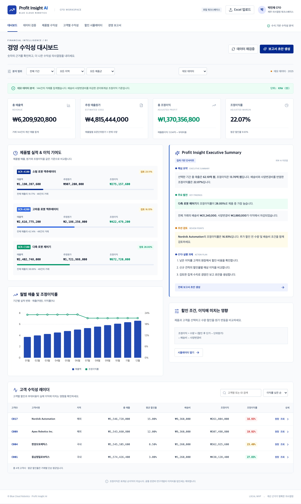

# Profit Insight AI



블루 클라우드 로보틱스 CFO를 위한 로컬 수익성 분석 MVP입니다. `xref/C41 SPEC Profit Insight AI.md`의 계산·검증 규칙과 Stitch의 `DESIGN.md`, CFO 화면을 참고했습니다.

## 최근 업데이트 (2026-09-18)

- **e2e 테스트 셀렉터 수정**: `tests/browser/app.spec.ts`가 `<label>` 텍스트 대신 접근성 role 기준으로 폼 요소를 찾도록 변경했습니다. `getByLabel('제품')` / `getByLabel('원가 기준월')` → `getByRole('combobox', { name: ..., exact: true })`, `getByText('test-upload.xlsx')` → 업로드 파일명이 표시되는 영역(`.source`)을 기준으로 하는 locator로 교체해, 실제 렌더링된 DOM 구조와 어긋나 타임아웃 나던 테스트를 고쳤습니다.
- **전체 검증 파이프라인 재확인**: 백엔드 단위 테스트(`pytest`, 13건), 프런트엔드 빌드(`tsc -b && vite build`), 브라우저 통합 테스트(`playwright test`, 2건) 모두 통과를 재확인했습니다. 데스크톱·모바일 대시보드 화면을 직접 캡처해 레이아웃 깨짐이 없는 것도 확인했습니다.
- **프로젝트 폴더명 변경**: `gr-260918-cfo` → `goorm-260918-cfo`. GitHub 리포지토리 이름과 일치시키기 위한 변경입니다.
- **`.venv` 재생성**: 폴더명 변경으로 `.venv/bin/uvicorn`, `.venv/bin/pip` 등 가상환경 스크립트의 shebang이 가리키던 절대경로(`.../gr-260918-cfo/.venv/bin/python3`)가 깨졌습니다. `requirements.txt` 기준으로 새 경로에서 가상환경을 다시 만들어 해결했습니다(`.venv`는 `.gitignore` 대상이라 저장소에는 포함되지 않으며, 새로 클론한 환경에서는 아래 "실행" 절차대로 만들면 됩니다).
- **단일 컨테이너 배포 지원 추가**: 기존에는 프론트(`/api` 상대경로 fetch)와 백엔드가 Vite dev 프록시로만 연결되어 있어 빌드 산출물(`dist/`)만으로는 배포할 수 없었습니다. `backend/main.py`가 `dist/`를 직접 서빙하도록 `StaticFiles`를 마운트하고, `Dockerfile`로 프론트 빌드와 백엔드를 한 이미지에 묶어 CORS 설정 없이 동일 출처로 배포할 수 있게 했습니다. 배포 환경을 위한 최소한의 `BASIC_AUTH_USER`/`BASIC_AUTH_PASS` 접근 제어도 추가했습니다(자세한 내용은 아래 "배포" 절 참고).

## 실행

Node.js 22.12 이상, Python 3.9 이상이 필요합니다.

```bash
npm ci
python3 -m venv .venv
.venv/bin/pip install -r requirements.txt
```

터미널 1:

```bash
.venv/bin/uvicorn backend.main:app --host 127.0.0.1 --port 8000
```

터미널 2:

```bash
npm run dev
```

- 앱: http://127.0.0.1:5173
- API 문서: http://127.0.0.1:8000/docs
- 처음에는 **가상 데모 데이터** 144건과 월별 원가 36건으로 시작합니다.
- `데이터 검증 → 데모 Excel 다운로드`로 업로드 형식과 실제 계산을 확인할 수 있습니다.

## 구현한 기능

- 반응형 CFO 대시보드, 제품별·고객별·월별 집계
- 기간·지역·제품군 필터, 고객 검색·정렬, 거래 원장 조회
- Excel 업로드, 시트 선택, 필수 컬럼·값·날짜·중복·마스터·매출·원가 검증
- 해당 매출월의 원가가 없거나 검증 오류가 있으면 분석 차단
- 제품·고객·수량·원가 기준월·배송비·사양변경비·원가 변동에 따른 할인 비교
- 집계 기반 규칙형 보고서 초안, Markdown 다운로드, 브라우저 인쇄/PDF 저장
- 원본 파일, 파싱 데이터, 검증·분석·보고서 기록을 `.data/`에 로컬 저장

## 계산 기준

`Decimal`로 거래 계산을 처리합니다. 매출은 `수량 × 단가 × (1 − 할인율)`, 원가는 `수량 × 해당 월 표준단위원가`, 조정이익은 `매출 − 원가 − 배송비 − 사양변경비`입니다. 집계 이익률은 이익 합계 ÷ 매출 합계이며 평균 할인율은 **거래별 단순 평균**입니다. 화면 원화 표시는 원 단위 반올림이며 내부 비교는 원본 소수 정밀도를 유지합니다.

조정이익은 공통 판관비·연구개발비·이자비용·법인세를 제외한 관리회계 지표입니다. KRW만 지원하며 자동 환산하지 않습니다. Excel 수식 셀은 저장된 계산 결과를 읽으므로 Excel에서 재계산 후 저장해 주세요.

## 검증

```bash
.venv/bin/python -m pytest -q
npm run build
npx playwright install chromium
# API와 Vite 서버를 켠 상태에서:
npm run test:e2e
```

테스트는 별도의 임시 DB를 사용합니다(API 테스트). 브라우저 통합 테스트의 업로드는 실행 중인 로컬 서버 `.data/`에 기록됩니다.

## 배포 (Docker)

`Dockerfile`은 React 빌드와 FastAPI 백엔드를 한 이미지로 묶어, `backend/main.py`가 `/api/*`는 API로, 그 외 경로는 빌드된 `dist/`를 정적으로 서빙합니다. 프론트가 별도 도메인/포트로 나뉘지 않으므로 CORS 설정이 필요 없습니다.

```bash
docker build -t profit-insight-ai .
docker run -p 8000:8000 \
  -e BASIC_AUTH_USER=cfo \
  -e BASIC_AUTH_PASS='강력한-비밀번호로-교체' \
  -v profit-insight-data:/data \
  profit-insight-ai
```

- 앱과 API가 모두 http://localhost:8000 에서 서빙됩니다 (API 문서는 `/docs`).
- `-v profit-insight-data:/data`: SQLite 이력(`profit.db`)과 업로드 원본 Excel을 컨테이너 재배포 후에도 유지하는 **영구 볼륨**입니다. 이 마운트 없이 배포하면 재배포·재시작 시 데이터가 사라집니다.
- `BASIC_AUTH_USER`/`BASIC_AUTH_PASS`: 둘 다 설정하면 전체 화면과 API가 HTTP Basic Auth로 보호됩니다(재무 데이터가 공개 인터넷에 인증 없이 노출되는 것을 막는 최소 장치입니다). 둘 다 비워두면 로컬 개발처럼 인증 없이 동작합니다 — **배포 시에는 반드시 설정하세요.** 헬스체크용 `/api/health`만 인증 없이 열려 있습니다.

**PaaS 배포 (Render / Railway / Fly.io 등 Dockerfile 기반 플랫폼 공통)**

1. 리포지토리를 연결하고 Dockerfile 빌드를 사용하도록 지정합니다.
2. 환경변수에 `BASIC_AUTH_USER`, `BASIC_AUTH_PASS`를 설정합니다.
3. `/data` 경로에 영구 디스크(persistent volume/disk)를 추가합니다. 경로를 바꾸고 싶다면 `PROFIT_DATA_DIR` 환경변수로 지정할 수 있습니다.
4. 헬스체크 경로를 `/api/health`로 지정합니다.

이 구성은 여전히 **단일 사용자 기준**입니다. 여러 명이 서로 다른 자격으로 접근해야 한다면 Basic Auth 한 쌍으로는 부족하며, 아래 "현재 범위와 남은 연동"에 정리한 사용자별 인증·권한 작업이 필요합니다.

## 현재 범위와 남은 연동

이 버전은 **단일 사용자 로컬 MVP**입니다. 로그인·역할별 권한, PostgreSQL, 외부 OpenAI 호출은 아직 구현하지 않았습니다. 보고서는 외부 AI 생성으로 표시하지 않으며 검증된 집계를 템플릿으로 서술합니다. 원본 재무 데이터의 외부 전송은 없습니다. 배포 시 최소한의 Basic Auth 접근 제어는 추가했지만(위 "배포" 절 참고), 운영 도입 전에는 사용자별 파일 접근 통제와 인증, 비밀키 관리, 보관 정책을 별도로 추가해야 합니다.

명세에 기재된 연매출 2,953,534,400원 및 조정이익 771,844,400원의 **원본 Excel은 제공되지 않았으므로 해당 총액 대사는 아직 수행하지 않았습니다**. 데모는 별도 가상 거래에서 계산한 값으로, 명세 예시 총액을 화면에 고정하지 않았습니다. 할인 시뮬레이션 0/5/10% 예제 금액은 자동 테스트로 검증합니다. Stitch의 감사 인증·보안 등급·모델 신뢰도 문구는 검증되지 않은 주장이므로 사용하지 않았습니다.

## 구조

- `src/main.tsx`, `src/styles.css`: React·TypeScript UI 및 디자인 토큰
- `backend/engine.py`: 독립적인 검증·계산 엔진
- `backend/main.py`: FastAPI, Excel 처리 및 SQLite 이력
- `tests/test_engine.py`, `tests/test_api.py`: 계산·검증·API 테스트
- `tests/browser/app.spec.ts`: 데스크톱·모바일 전체 업무 흐름 테스트
- `Dockerfile`: React 빌드 + FastAPI를 한 이미지로 묶는 단일 컨테이너 배포 정의

기술 참고: [FastAPI 파일 업로드](https://fastapi.tiangolo.com/tutorial/request-files/), [Vite 시작하기](https://vite.dev/guide/).
