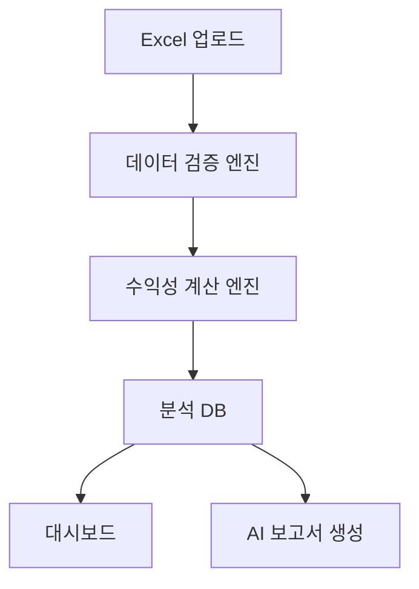

# Profit Insight AI 기술 명세서

## 1. 프로젝트 개요

**Profit Insight AI**는 블루 클라우드 로보틱스의 CFO가 제품별·고객별 수익성을 빠르게 확인하고, 할인 조건이나 원가 변동이 이익에 미치는 영향을 검토할 수 있도록 돕는 AI 기반 수익성 분석 솔루션이다.

현재 박민재 CFO의 핵심 문제는 매출은 증가하고 있지만 제품, 고객, 월별 수익성을 빠르게 파악하기 어렵다는 점이다. 매출 자료와 원가 자료가 분리되어 있어 수작업 집계가 필요하고, 할인율·배송비·사양변경비 등 실제 이익에 영향을 주는 항목을 반영한 분석이 늦어질 수 있다.

Profit Insight AI는 Excel 기반 매출·원가 데이터를 업로드하면 자동으로 데이터를 검증하고, 제품별·고객별 수익성을 계산한 뒤 CFO용 보고서 초안을 생성한다.

---

## 2. 한 줄 정의

> 매출·원가 데이터를 자동 분석해 제품별·고객별 수익성과 할인 시뮬레이션을 제공하는 CFO용 AI 분석 웹앱

---

## 3. 주요 사용자

### 3.1 핵심 사용자

**박민재 CFO**

* 경영학 전공
* 공인회계사
* 매출·원가·손익 분석에 익숙함
* 빠른 수치 검증과 경영진 보고서 초안 작성이 필요함
* AI 결과를 그대로 믿기보다 계산 근거를 확인하고 싶어 함

### 3.2 보조 사용자

* CEO
* 영업팀장
* 생산관리 담당자
* 회계·재무 실무자

---

## 4. 해결하려는 업무 문제

블루 클라우드 로보틱스는 로봇 액추에이터와 제어기를 판매하는 제조 기업이다. 매출이 증가하면서 제품과 고객이 다양해지고 있지만, 현재 CFO가 빠르게 확인하기 어려운 정보는 다음과 같다.

1. 어떤 제품이 실제로 가장 높은 이익을 내는가?
2. 매출이 큰 고객이 실제로도 수익성이 좋은 고객인가?
3. 특정 고객에게 제공한 할인율이 이익률을 얼마나 낮추는가?
4. 원가 상승이 특정 제품군의 수익성에 어떤 영향을 주는가?
5. 보고서 작성 전에 매출·원가 데이터에 오류가 없는가?

Profit Insight AI는 위 질문에 대해 CFO가 바로 확인할 수 있는 분석 화면과 보고서 초안을 제공한다.

---

## 5. 업무 흐름

**Excel 업로드 → 데이터 검증 → 수익성 계산 → AI 해석 → 시뮬레이션 → 보고서 초안 생성**

### 5.1 상세 흐름

1. CFO 또는 재무 담당자가 매출·원가 Excel 파일을 업로드한다.
2. 시스템이 필수 컬럼, 날짜 형식, 제품코드, 고객ID, 중복 거래, 매출 계산 오류를 검증한다.
3. 검증을 통과한 데이터를 기준으로 거래별 매출총이익과 조정이익을 계산한다.
4. 제품별·고객별·월별 수익성 대시보드를 생성한다.
5. CFO가 할인율, 수량, 원가 변동 조건을 입력해 이익 시뮬레이션을 실행한다.
6. AI가 주요 인사이트와 보고서 초안을 작성한다.
7. CFO는 수치와 근거를 확인한 뒤 경영진 보고에 활용한다.

---

## 6. MVP 범위

### 6.1 MVP 핵심 기능

* Excel 매출·원가 데이터 업로드
* 제품·고객 마스터 데이터 연동
* 데이터 오류 자동 검증
* 거래별 수익성 계산
* 제품별 수익성 분석
* 고객별 수익성 분석
* 월별 수익성 추이 분석
* 할인율별 이익 시뮬레이션
* CFO 보고서 초안 자동 생성

### 6.2 MVP에서 제외할 기능

* ERP 실시간 연동
* 세금계산서 자동 수집
* 재무제표 자동 작성
* 법인세·부가세 계산
* 재고수불부 기반 실제 원가 계산
* 외부 환율 API 자동 반영
* 권한별 결재 워크플로우

MVP는 Excel 기반의 반자동 분석 도구로 시작하고, 이후 ERP·회계 시스템 연동으로 확장한다.

---

## 7. 입력 데이터 명세

### 7.1 매출 데이터

시트명 예시: `매출_정상`

| 컬럼명       | 설명                    | 예시            |
| --------- | --------------------- | ------------- |
| 거래ID      | 거래 고유 ID              | TX0001        |
| 주문번호      | 주문 식별 번호              | ORD-2025-0001 |
| 매출인식일     | 매출 인식 날짜              | 2025-01-15    |
| 매출월       | 매출 월                  | 2025-01       |
| 고객ID      | 고객 마스터 ID             | C001          |
| 제품코드      | 제품 마스터 코드             | BCR-A100      |
| 수량        | 판매 수량                 | 20            |
| 할인전단가_KRW | 정가 기준 단가              | 420000        |
| 할인율       | 적용 할인율                | 0.05          |
| 기록매출액_KRW | Excel 또는 ERP에 기록된 매출액 | 7980000       |
| 배송비_KRW   | 거래별 배송비               | 35000         |
| 사양변경비_KRW | 고객 맞춤 사양 변경 비용        | 0             |
| 통화        | 통화 코드                 | KRW           |

### 7.2 원가 데이터

시트명 예시: `원가_정상`

| 컬럼명        | 설명          | 예시       |
| ---------- | ----------- | -------- |
| 기준월        | 원가 기준 월     | 2025-01  |
| 제품코드       | 제품 코드       | BCR-A100 |
| 재료비_KRW    | 단위당 재료비     | 170000   |
| 노무비_KRW    | 단위당 노무비     | 42000    |
| 외주가공비_KRW  | 단위당 외주가공비   | 38000    |
| 제조간접비_KRW  | 단위당 제조간접비   | 35000    |
| 표준단위원가_KRW | 단위당 표준원가 합계 | 285000   |

### 7.3 제품 마스터

시트명 예시: `제품마스터`

| 컬럼명        | 설명       | 예시          |
| ---------- | -------- | ----------- |
| 제품코드       | 제품 고유 코드 | BCR-A100    |
| 제품명        | 제품명      | 소형 로봇 액추에이터 |
| 제품군        | 제품 분류    | Actuator    |
| 기본판매단가_KRW | 기준 판매 단가 | 420000      |

### 7.4 고객 마스터

시트명 예시: `고객마스터`

| 컬럼명   | 설명         | 예시      |
| ----- | ---------- | ------- |
| 고객ID  | 고객 고유 ID   | C001    |
| 고객명   | 고객명        | 가상고객 01 |
| 지역    | 국내/해외 구분   | 국내      |
| 산업    | 고객 산업군     | 제조      |
| 기본할인율 | 고객별 기본 할인율 | 0.03    |

---

## 8. 주요 계산 로직

### 8.1 거래별 계산 매출액

```text
계산매출액 = 수량 × 할인전단가 × (1 - 할인율)
```

### 8.2 매출 검증 차이

```text
매출차이 = 기록매출액 - 계산매출액
```

매출차이가 0이 아니면 데이터 오류 후보로 표시한다.

### 8.3 단위당 표준원가

```text
표준단위원가 = 재료비 + 노무비 + 외주가공비 + 제조간접비
```

### 8.4 거래별 추정 매출원가

```text
추정매출원가 = 수량 × 표준단위원가
```

### 8.5 거래별 매출총이익

```text
매출총이익 = 계산매출액 - 추정매출원가
```

### 8.6 거래별 조정이익

```text
조정이익 = 매출총이익 - 배송비 - 사양변경비
```

### 8.7 조정이익률

```text
조정이익률 = 조정이익 ÷ 계산매출액
```

이 프로젝트에서는 법인 공통 판관비, 연구개발비, 이자비용, 법인세는 제외한다. 따라서 조정이익은 회계상 순이익이 아니라 제품·고객 단위의 영업 의사결정을 위한 관리회계 지표로 정의한다.

---

## 9. 데이터 검증 규칙

Profit Insight AI는 분석 전에 데이터 오류를 먼저 탐지해야 한다.

### 9.1 필수값 검증

다음 항목이 비어 있으면 오류로 표시한다.

* 거래ID
* 매출인식일
* 매출월
* 고객ID
* 제품코드
* 수량
* 할인전단가
* 할인율
* 기록매출액
* 통화

### 9.2 마스터 데이터 검증

* 매출 데이터의 고객ID가 고객마스터에 존재해야 한다.
* 매출 데이터의 제품코드가 제품마스터에 존재해야 한다.
* 원가 데이터의 제품코드가 제품마스터에 존재해야 한다.

### 9.3 숫자 범위 검증

* 수량은 0보다 커야 한다.
* 할인전단가는 0보다 커야 한다.
* 할인율은 0 이상 1 미만이어야 한다.
* 표준단위원가는 0보다 커야 한다.
* 배송비와 사양변경비는 0 이상이어야 한다.

### 9.4 날짜 검증

* 매출인식일은 실제 날짜 형식이어야 한다.
* 매출월은 `YYYY-MM` 형식이어야 한다.
* 매출인식일의 월과 매출월이 일치해야 한다.

### 9.5 매출액 검증

시스템 계산 매출액과 기록매출액이 다르면 오류로 표시한다.

```text
기록매출액 ≠ 수량 × 할인전단가 × (1 - 할인율)
```

### 9.6 중복 거래 검증

동일한 거래ID가 2개 이상 존재하면 중복 오류로 표시한다.

### 9.7 원가 검증

원가 데이터에서 다음 식이 일치해야 한다.

```text
표준단위원가 = 재료비 + 노무비 + 외주가공비 + 제조간접비
```

---

## 10. 주요 화면 명세

### 10.1 파일 업로드 화면

사용자는 매출·원가 Excel 파일을 업로드한다.

필수 기능:

* Excel 파일 업로드
* 업로드 파일명 표시
* 포함된 시트 목록 표시
* 필수 시트 존재 여부 확인
* 검증 실행 버튼

화면 메시지 예시:

> 매출 데이터 240건, 원가 데이터 36건을 확인했습니다.
> 검증 오류 0건입니다. 분석을 진행할 수 있습니다.

---

### 10.2 데이터 검증 화면

업로드된 데이터의 오류를 표 형태로 보여준다.

표시 항목:

| 항목    | 설명                          |
| ----- | --------------------------- |
| 오류 위치 | 시트명, 행 번호                   |
| 오류 유형 | 필수값 누락, 잘못된 제품코드, 매출액 불일치 등 |
| 현재 값  | 업로드된 값                      |
| 권장 수정 | 수정 방향                       |
| 심각도   | 높음, 보통, 낮음                  |

오류 예시:

| 시트    |  행 | 오류 유형     | 현재 값   | 권장 수정              |
| ----- | -: | --------- | ------ | ------------------ |
| 매출_오류 |  7 | 미등록 고객ID  | C999   | 고객마스터에 등록된 고객ID 사용 |
| 매출_오류 | 47 | 수량 누락     | 빈 값    | 수량 입력              |
| 원가_오류 | 30 | 원가 합계 불일치 | 585000 | 구성 원가 합계와 일치하도록 수정 |

---

### 10.3 수익성 대시보드

CFO가 전체 수익성을 한눈에 볼 수 있는 화면이다.

핵심 지표:

* 총 매출
* 총 추정 매출원가
* 총 매출총이익
* 총 조정이익
* 조정이익률
* 평균 할인율
* 수익성 상위 제품
* 수익성 하위 고객

분석 축:

* 제품별
* 고객별
* 월별
* 국내/해외별
* 제품군별

---

### 10.4 제품별 수익성 화면

제품별 매출과 이익을 비교한다.

표시 항목:

| 제품코드     | 제품명          |            매출 |          추정원가 |        조정이익 | 조정이익률 |
| -------- | ------------ | ------------: | ------------: | ----------: | ----: |
| BCR-A100 | 소형 로봇 액추에이터  |   811,767,600 |   600,396,000 | 211,371,600 | 26.0% |
| BCR-A200 | 고하중 로봇 액추에이터 | 1,521,421,200 | 1,149,080,000 | 372,341,200 | 24.5% |
| BCR-C100 | 로봇 제어기       |   620,345,600 |   432,214,000 | 188,131,600 | 30.3% |

AI 설명 예시:

> BCR-A200은 매출 규모가 가장 크지만 조정이익률은 BCR-C100보다 낮습니다. 대형 고객 할인율과 하반기 재료비 상승이 이익률 하락의 주요 원인으로 보입니다.

---

### 10.5 고객별 수익성 화면

고객별 매출과 이익률을 비교한다.

핵심 질문:

* 매출 상위 고객이 이익 상위 고객인가?
* 할인율이 높은 고객의 조정이익률은 낮아졌는가?
* 해외 고객의 배송비가 이익률에 미치는 영향은 어느 정도인가?

표시 항목:

| 고객ID | 고객명                |          매출 |       조정이익 | 조정이익률 | 평균 할인율 |
| ---- | ------------------ | ----------: | ---------: | ----: | -----: |
| C017 | Nordvik Automation | 200,000,000 | 32,000,000 | 16.0% |  15.0% |

AI 설명 예시:

> C017 고객은 매출 규모는 크지만 평균 할인율이 높아 조정이익률이 낮습니다. 추가 할인 요청이 있을 경우 수량 증가 또는 배송비 전가 조건을 함께 검토해야 합니다.

---

### 10.6 할인 시뮬레이션 화면

CFO가 특정 견적 조건을 입력하면 예상 이익을 계산한다.

입력 항목:

| 항목    | 설명          |
| ----- | ----------- |
| 제품코드  | 견적 대상 제품    |
| 고객ID  | 견적 대상 고객    |
| 수량    | 예상 판매 수량    |
| 할인율   | 적용 예정 할인율   |
| 배송비   | 예상 배송비      |
| 사양변경비 | 예상 사양 변경 비용 |
| 기준월   | 적용 원가 기준 월  |

출력 항목:

* 예상 매출
* 예상 매출원가
* 예상 매출총이익
* 예상 조정이익
* 예상 조정이익률
* 할인율별 비교 결과

예시:

| 제품       | 수량 | 할인율 |      예상 매출 |   예상 조정이익 | 조정이익률 |
| -------- | -: | --: | ---------: | --------: | ----: |
| BCR-A200 | 30 |  0% | 23,400,000 | 5,890,000 | 25.2% |
| BCR-A200 | 30 |  5% | 22,230,000 | 4,720,000 | 21.2% |
| BCR-A200 | 30 | 10% | 21,060,000 | 3,550,000 | 16.9% |

AI 설명 예시:

> BCR-A200 30대 견적에서 할인율이 0%에서 10%로 증가하면 조정이익은 5,890,000원에서 3,550,000원으로 감소합니다. 할인율 10% 조건은 이익률이 20% 미만으로 낮아지므로 CFO 검토가 필요합니다.

---

## 11. AI 기능 명세

### 11.1 AI 역할

AI는 계산을 직접 대신하는 역할보다, 계산된 결과를 CFO가 이해하기 쉬운 언어로 설명하고 보고서 초안을 작성하는 역할을 담당한다.

계산은 코드와 수식으로 처리하고, AI는 다음 작업을 수행한다.

* 분석 결과 요약
* 수익성 저하 원인 설명
* 이상 거래 후보 해석
* 할인 시뮬레이션 결과 설명
* 경영진 보고서 초안 작성
* CFO가 확인해야 할 질문 제안

### 11.2 AI 입력 데이터

AI에는 원본 전체 데이터가 아니라 집계된 분석 결과를 전달한다.

예시 입력:

```json
{
  "period": "2025년",
  "total_revenue": 2953534400,
  "adjusted_profit": 771844400,
  "adjusted_margin": 0.2613,
  "product_summary": [
    {
      "product_code": "BCR-A200",
      "revenue": 1521421200,
      "adjusted_profit": 372341200,
      "adjusted_margin": 0.245
    }
  ],
  "customer_risk": [
    {
      "customer_id": "C017",
      "customer_name": "Nordvik Automation",
      "avg_discount_rate": 0.15,
      "adjusted_margin": 0.16
    }
  ]
}
```

### 11.3 AI 출력 형식

AI는 다음 구조로 결과를 생성한다.

```json
{
  "executive_summary": "전체 매출은 증가했으나 일부 고객의 높은 할인율로 조정이익률이 낮아졌습니다.",
  "key_findings": [
    "BCR-A200은 매출 비중이 가장 높지만 조정이익률은 상대적으로 낮습니다.",
    "BCR-C100은 매출 규모는 작지만 조정이익률이 가장 높습니다."
  ],
  "risk_points": [
    "C017 고객은 평균 할인율이 높아 추가 할인 시 수익성 저하 가능성이 큽니다."
  ],
  "recommended_actions": [
    "A200 대형 고객 견적 시 최소 조정이익률 기준을 설정합니다.",
    "고할인 고객의 배송비와 사양변경비 전가 여부를 검토합니다."
  ]
}
```

---

## 12. 시스템 구조

### 12.1 기본 구조



### 12.2 구성 요소

| 구성 요소                     | 역할                        |
| ------------------------- | ------------------------- |
| Frontend                  | 파일 업로드, 대시보드, 시뮬레이션 화면 제공 |
| Backend API               | 파일 처리, 검증, 계산, AI 요청 관리   |
| Validation Engine         | 데이터 오류 탐지                 |
| Profit Calculation Engine | 수익성 계산                    |
| AI Report Generator       | 분석 결과 설명 및 보고서 초안 생성      |
| Database                  | 업로드 이력, 분석 결과, 사용자 설정 저장  |
| File Storage              | 업로드 Excel 파일 저장           |

---

## 13. 추천 기술 스택

### 13.1 Frontend

* React
* TypeScript
* Tailwind CSS
* Recharts 또는 ECharts

### 13.2 Backend

* Python FastAPI 또는 Node.js NestJS
* Pandas 기반 Excel 처리
* OpenPyXL 기반 Excel 파싱
* PostgreSQL

### 13.3 AI

* OpenAI API
* Structured Output
* Prompt Template
* Function Calling 또는 Tool Calling

### 13.4 배포

* 초기 MVP: Streamlit 또는 Next.js + FastAPI
* 사내 도입형: Docker 기반 배포
* 확장형: AWS, Azure, 또는 GCP

---

## 14. API 명세

### 14.1 Excel 업로드 API

```http
POST /api/files/upload
```

요청:

* multipart/form-data
* file: Excel 파일

응답:

```json
{
  "file_id": "file_001",
  "sheets": ["매출_정상", "원가_정상", "제품마스터", "고객마스터"],
  "status": "uploaded"
}
```

---

### 14.2 데이터 검증 API

```http
POST /api/validation/run
```

요청:

```json
{
  "file_id": "file_001",
  "sales_sheet": "매출_정상",
  "cost_sheet": "원가_정상"
}
```

응답:

```json
{
  "validation_status": "passed",
  "error_count": 0,
  "errors": []
}
```

오류가 있는 경우:

```json
{
  "validation_status": "failed",
  "error_count": 3,
  "errors": [
    {
      "sheet": "매출_오류",
      "row": 7,
      "field": "고객ID",
      "error_type": "UNKNOWN_CUSTOMER",
      "current_value": "C999",
      "message": "고객마스터에 존재하지 않는 고객ID입니다."
    }
  ]
}
```

---

### 14.3 수익성 분석 API

```http
POST /api/profit/analyze
```

요청:

```json
{
  "file_id": "file_001",
  "period": "2025"
}
```

응답:

```json
{
  "total_revenue": 2953534400,
  "total_adjusted_profit": 771844400,
  "adjusted_margin": 0.26132907,
  "by_product": [],
  "by_customer": [],
  "by_month": []
}
```

---

### 14.4 할인 시뮬레이션 API

```http
POST /api/simulation/discount
```

요청:

```json
{
  "product_code": "BCR-A200",
  "customer_id": "C017",
  "quantity": 30,
  "base_price": 780000,
  "discount_rates": [0, 0.05, 0.1],
  "cost_month": "2025-12",
  "shipping_cost": 260000,
  "custom_cost": 0
}
```

응답:

```json
{
  "results": [
    {
      "discount_rate": 0,
      "revenue": 23400000,
      "adjusted_profit": 5890000,
      "adjusted_margin": 0.2517
    },
    {
      "discount_rate": 0.05,
      "revenue": 22230000,
      "adjusted_profit": 4720000,
      "adjusted_margin": 0.2123
    },
    {
      "discount_rate": 0.1,
      "revenue": 21060000,
      "adjusted_profit": 3550000,
      "adjusted_margin": 0.1686
    }
  ]
}
```

---

### 14.5 AI 보고서 생성 API

```http
POST /api/ai/report
```

요청:

```json
{
  "analysis_id": "analysis_001",
  "report_type": "cfo_summary",
  "language": "ko"
}
```

응답:

```json
{
  "title": "2025년 제품·고객별 수익성 분석 보고서",
  "executive_summary": "...",
  "key_findings": [],
  "risk_points": [],
  "recommended_actions": []
}
```

---

## 15. 데이터베이스 설계 초안

### 15.1 files

| 컬럼명         | 타입        | 설명      |
| ----------- | --------- | ------- |
| id          | UUID      | 파일 ID   |
| file_name   | varchar   | 파일명     |
| uploaded_by | varchar   | 업로드 사용자 |
| uploaded_at | timestamp | 업로드 일시  |
| status      | varchar   | 처리 상태   |

### 15.2 sales_transactions

| 컬럼명              | 타입      | 설명    |
| ---------------- | ------- | ----- |
| id               | UUID    | 내부 ID |
| transaction_id   | varchar | 거래ID  |
| order_no         | varchar | 주문번호  |
| revenue_date     | date    | 매출인식일 |
| revenue_month    | varchar | 매출월   |
| customer_id      | varchar | 고객ID  |
| product_code     | varchar | 제품코드  |
| quantity         | numeric | 수량    |
| list_price       | numeric | 할인전단가 |
| discount_rate    | numeric | 할인율   |
| recorded_revenue | numeric | 기록매출액 |
| shipping_cost    | numeric | 배송비   |
| custom_cost      | numeric | 사양변경비 |
| currency         | varchar | 통화    |

### 15.3 product_costs

| 컬럼명                | 타입      | 설명     |
| ------------------ | ------- | ------ |
| id                 | UUID    | 내부 ID  |
| cost_month         | varchar | 기준월    |
| product_code       | varchar | 제품코드   |
| material_cost      | numeric | 재료비    |
| labor_cost         | numeric | 노무비    |
| outsourcing_cost   | numeric | 외주가공비  |
| overhead_cost      | numeric | 제조간접비  |
| standard_unit_cost | numeric | 표준단위원가 |

### 15.4 profit_results

| 컬럼명                | 타입      | 설명       |
| ------------------ | ------- | -------- |
| id                 | UUID    | 분석 결과 ID |
| transaction_id     | varchar | 거래ID     |
| calculated_revenue | numeric | 계산매출액    |
| estimated_cogs     | numeric | 추정매출원가   |
| gross_profit       | numeric | 매출총이익    |
| adjusted_profit    | numeric | 조정이익     |
| adjusted_margin    | numeric | 조정이익률    |

---

## 16. 권한 및 보안

### 16.1 사용자 권한

| 권한            | 설명                     |
| ------------- | ---------------------- |
| CFO           | 전체 데이터 업로드, 분석, 보고서 생성 |
| Finance Staff | 파일 업로드, 검증, 기본 분석      |
| CEO           | 대시보드와 보고서 조회           |
| Sales Manager | 고객별 분석 일부 조회           |

### 16.2 보안 요구사항

* 업로드 파일은 사용자별 접근 권한을 적용한다.
* 원본 Excel 파일과 분석 결과를 분리 저장한다.
* AI에는 필요한 집계 데이터만 전달한다.
* 고객명, 가격, 할인율 등 민감 정보는 로그에 남기지 않는다.
* 파일 업로드 이력과 보고서 생성 이력을 기록한다.

---

## 17. 검증 기준

MVP 구현 후 다음 기준을 만족해야 한다.

### 17.1 데이터 검증 기준

* 의도적으로 삽입된 오류 12건을 탐지할 수 있어야 한다.
* 미등록 고객ID를 탐지해야 한다.
* 미등록 제품코드를 탐지해야 한다.
* 수량 누락을 탐지해야 한다.
* 할인율 범위 오류를 탐지해야 한다.
* 매출액 계산 불일치를 탐지해야 한다.
* 잘못된 날짜 형식을 탐지해야 한다.
* 중복 거래ID를 탐지해야 한다.
* 원가 합계 불일치를 탐지해야 한다.

### 17.2 계산 검증 기준

정상 데이터 기준으로 다음 결과가 일치해야 한다.

| 구분     |              값 |
| ------ | -------------: |
| 총 매출   | 2,953,534,400원 |
| 총 조정이익 |   771,844,400원 |
| 조정이익률  |         26.13% |

제품별 결과:

| 제품코드     |             매출 |         조정이익 |
| -------- | -------------: | -----------: |
| BCR-A100 |   811,767,600원 | 211,371,600원 |
| BCR-A200 | 1,521,421,200원 | 372,341,200원 |
| BCR-C100 |   620,345,600원 | 188,131,600원 |

### 17.3 AI 보고서 검증 기준

AI 보고서는 다음 조건을 만족해야 한다.

* 계산 수치를 임의로 변경하지 않는다.
* 총 매출, 조정이익, 조정이익률을 정확히 인용한다.
* 제품별·고객별 주요 차이를 설명한다.
* 수익성 저하 원인을 데이터 근거와 함께 설명한다.
* CFO가 취할 수 있는 실행 과제를 제안한다.
* 확정적 회계 판단이 필요한 내용은 CFO 검토 대상으로 표현한다.

---

## 18. 프롬프트 설계

### 18.1 CFO 요약 보고서 프롬프트

```text
당신은 제조기업 CFO를 지원하는 재무 분석 AI입니다.

아래 수익성 분석 결과를 바탕으로 CFO가 CEO에게 보고할 수 있는 요약 보고서를 작성하세요.

작성 기준:
1. 숫자는 제공된 데이터만 사용하세요.
2. 계산되지 않은 수치는 추정하지 마세요.
3. 제품별·고객별 수익성 차이를 설명하세요.
4. 할인율, 원가, 배송비, 사양변경비가 이익에 미치는 영향을 설명하세요.
5. 마지막에는 CFO가 검토해야 할 실행 과제 3가지를 제안하세요.

입력 데이터:
{analysis_json}

출력 형식:
- 핵심 요약
- 주요 발견사항
- 수익성 리스크
- 권장 실행 과제
```

### 18.2 오류 설명 프롬프트

```text
당신은 재무 데이터 검증 담당자입니다.

아래 검증 오류 목록을 CFO가 이해하기 쉬운 말로 설명하세요.

작성 기준:
1. 오류 유형별로 묶어서 설명하세요.
2. 분석 결과에 미치는 영향을 설명하세요.
3. 수정 우선순위를 제안하세요.
4. 기술적인 표현보다 업무적인 표현을 사용하세요.

입력 데이터:
{validation_errors}
```

---

## 19. MVP 개발 일정

### 1주차: 데이터 구조 및 업로드

* Excel 샘플 데이터 확정
* 업로드 기능 구현
* 시트 및 컬럼 매핑 구현
* 기본 파싱 로직 구현

### 2주차: 검증 및 계산 엔진

* 데이터 검증 규칙 구현
* 거래별 수익성 계산
* 제품별·고객별·월별 집계 구현
* 검증 결과 화면 구현

### 3주차: 대시보드 및 시뮬레이션

* 수익성 대시보드 구현
* 제품별·고객별 상세 화면 구현
* 할인 시뮬레이션 기능 구현
* 차트 및 테이블 UI 구현

### 4주차: AI 보고서 및 최종 검증

* AI 보고서 생성 기능 구현
* 프롬프트 및 Structured Output 적용
* 샘플 데이터 기준 결과 검증
* 사용자 테스트 및 개선

---

## 20. 최종 산출물

MVP 완료 시 다음 산출물을 제공한다.

1. Profit Insight AI 웹앱
2. Excel 업로드 기능
3. 데이터 검증 기능
4. 수익성 분석 대시보드
5. 할인 시뮬레이션 화면
6. AI 보고서 생성 기능
7. 샘플 Excel 데이터
8. 검증 시나리오 및 테스트 결과
9. 사용자 매뉴얼 초안

---

## 21. 성공 기준

Profit Insight AI의 성공 기준은 다음과 같다.

* CFO가 Excel 업로드 후 1분 이내에 제품별·고객별 수익성을 확인할 수 있다.
* 데이터 오류를 보고서 작성 전에 자동으로 탐지할 수 있다.
* 할인율 변경이 이익에 미치는 영향을 즉시 확인할 수 있다.
* CEO 보고용 초안 작성 시간을 줄일 수 있다.
* CFO가 AI 결과의 계산 근거를 직접 확인할 수 있다.

Profit Insight AI는 단순한 챗봇이 아니라 CFO의 반복적인 수익성 분석 업무를 자동화하는 실무형 AI 분석 도구로 구현한다.
